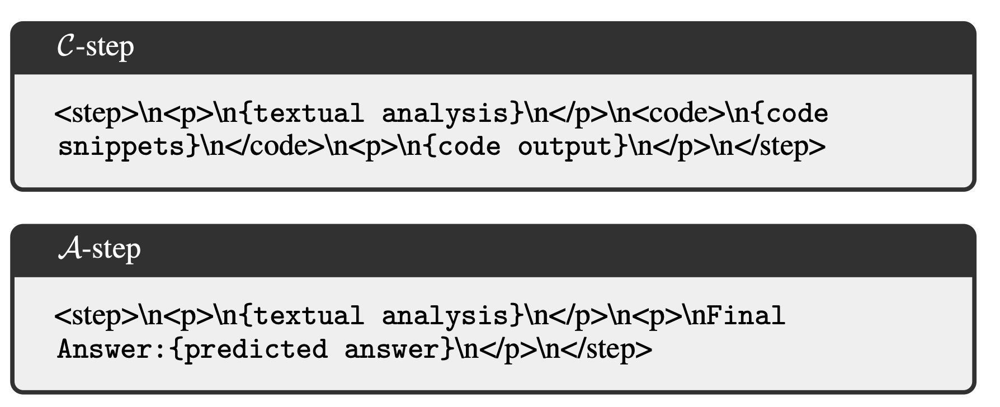
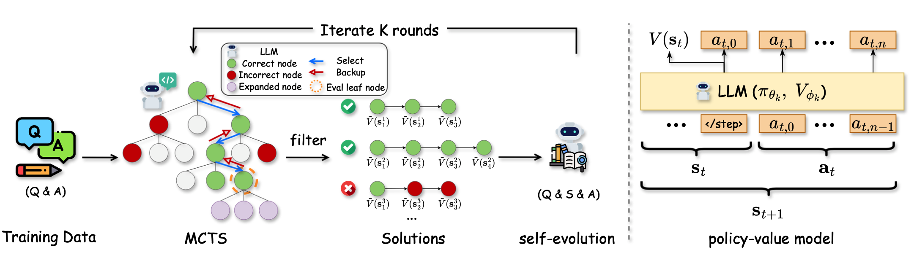
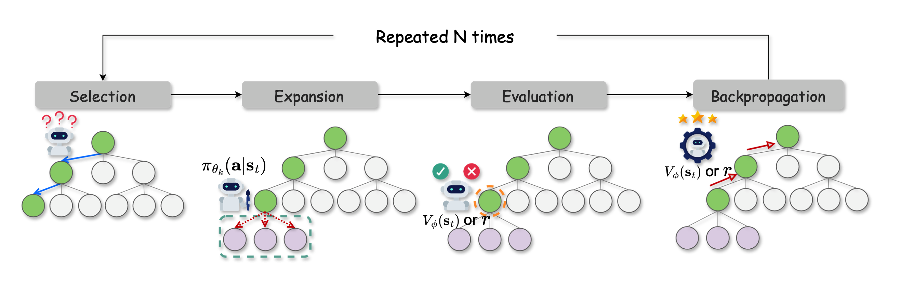

# [AlphaMath Almost Zero: Process Supervision without Process](https://arxiv.org/abs/2405.03553)

## Оглавление
1. [Аннотация](#аннотация)
2. [Введение](#введение)
3. [Фреймворк AlphaMath](#фреймворк-alphamath)
   1. [Monte Carlo Tree Search (MCTS)](#monte-carlo-tree-search-mcts)
   2. [Модель ценности (Value Model)](#модель-ценности-value-model)
   3. [Пошаговый поиск по лучу (Step-Level Beam Search)](#пошаговый-поиск-по-лучу-step-level-beam-search)
   4. [Итеративное обучение](#итеративное-обучение)
4. [Эксперименты и результаты](#эксперименты-и-результаты)
5. [Анализ](#анализ)
6. [Связанные работы](#связанные-работы)
7. [Ограничения и будущее](#ограничения-и-будущее)

---

## 1. Аннотация

Современные большие языковые модели (**LLMs**) добились значительных успехов в различных задачах. Однако они сталкиваются с трудностями в решении задач, требующих **сложного и символьного многошагового рассуждения**, таких как математическое доказательство или решение задач с большим количеством промежуточных шагов. Большинство современных подходов требуют:  
- Аннотаций процесса (**process-supervised data**), которые создаются либо экспертами, либо GPT-4. Это дорого и трудозатратно.  

В статье предложен новый фреймворк **AlphaMath**, который исключает необходимость в таких аннотациях. Основные особенности AlphaMath:  
1. Использование **Monte Carlo Tree Search (MCTS)** для поиска качественных решений без участия человека.  
2. Создание **модели ценности (Value Model)** для оценки качества промежуточных шагов решения.  
3. Реализация **поиска по лучу (Beam Search)** для оптимизации вывода.  

Эксперименты показывают, что даже без аннотированных данных AlphaMath достигает результатов, сравнимых с методами, использующими данные от GPT-4 или людей.  

---

## 2. Введение

### Контекст
Большие языковые модели обладают обширными знаниями, но их потенциал часто остается нереализованным из-за отсутствия эффективных методов для активации и использования этих знаний. Современные методы улучшают математические способности моделей с помощью **доменного обучения** или создания специализированных **процесс-супервизированных данных**, которые:  
1. Требуют больших затрат (аннотации делают либо эксперты, либо GPT-4).  
2. Полностью игнорируют внутренние знания моделей.  

### Главная идея AlphaMath
Вместо аннотированных данных AlphaMath использует:  
- **Monte Carlo Tree Search (MCTS)**, который позволяет изучать и улучшать многошаговые решения.  
- Интеграцию **Value Model** с LLM для оценки промежуточных шагов.  
- **Итеративное обучение**, где модель обучается на своих собственных выводах, избегая необходимости во внешних аннотациях.  

**Ключевой гипотезой** работы является то, что LLM уже обладают знаниями, достаточными для создания корректных решений, но требуется разработка методов для активации этих знаний.

---

## 3. Фреймворк AlphaMath

### Общая идея

* Дана задача $q$, решение которой 100% можно разбить на $T$ шагов.
* Конечное решение - $S$.
* Объеденённые мыслительные шаги (действия) - $A$.
* Объеденённые шаги исполнения кода - $C$.

* При фиксированом шаге $t$ мы получаем:
    - Частичное решение - $s_t$, хранящее в себе $q$ (вопрос/промпт) и логическая конкатенация $[s_{t-i}, 0 < i < t]$ (все предыдущие шаги, которые были выбраны MCTS в качестве предков $s_t$)
    - Шаг, который приводит к $s_t$ можно рассматривать как Действие - $a_t$
    - Policy модель воплощается в LLM - $\pi(a_t | s_t) = LLM(a_t | s_t)$
    - Переход из однго состояния в другое осуществляется при конкатенации - $s_{t+1} = \text{Concat}(s_t, a_t)$

* Главная цель создать step-level value model (оценочную модель по шагам) - $V_{\phi}(s)$

---

### 3.1 Monte Carlo Tree Search (MCTS)
**MCTS** используется для управления процессом поиска оптимальных решений. Его задача — сбалансировать две стратегии:  
1. **Exploration** (исследование новых путей).  
2. **Exploitation** (использование уже найденных качественных путей).  

MCTS состоит из 4 основных этапов:  

#### 1. Выбор (Selection)  
Выбор узлов дерева происходит по модифицированному алгоритму **PUCT (Predictor + Upper Confidence Bounds for Trees)**:  
$$
a_t = \arg\max_{a \in T_k} \left[ Q(s_t, a) + c_{puct} \pi_\theta(a|s_t) \sqrt{\frac{N_{\text{parent}}(a)}{1 + N(s_t, a)}} \right],
$$  
где:  
- $Q(s_t, a)$ — ожидаемое значение (value) текущего узла.  
- $\pi_\theta(a|s_t)$ — априорная вероятность действия $a$.  
- $N(s_t, a)$ — количество посещений узла.  

#### 2. Расширение (Expansion)  
При достижении листового узла $s_t$, MCTS использует LLM для генерации возможных шагов $a_{t+1}$, которые добавляются как новые узлы.

#### 3. Оценка (Evaluation)  
Каждый листовой узел оценивается с использованием модели ценности $V_\phi$:  
$$
\hat{V}(s_t) = (1 - \lambda) V_\phi(s_t) + \lambda r(s_t),
$$  
где:  
- $V_\phi(s_t)$ — прогнозируемое значение состояния.  
- $r(s_t)$ — награда (0 для промежуточных шагов, ±1 для конечных).  
- $\lambda$ — коэффициент, регулирующий баланс между моделью и эмпирической оценкой.  

#### 4. Обратное распространение (Backup)  
Результаты оценки узлов возвращаются к корню, обновляя $Q$-значения и частоты посещений:  
$$
Q(s, a) = \frac{1}{N(s, a)} \sum_{i=1}^{N(s, a)} V_\phi(s_i).
$$  

---

### 3.2 Модель ценности (Value Model)
**Value Model** предназначена для оценки качества промежуточных шагов. Она интегрирована с LLM через дополнительный линейный слой.  

Обучение модели основано на минимизации функции потерь:  
$$
L_{V_\phi}(s) = \| V_\phi(s) - \tilde{V}(s) \|^2,
$$  
где $\tilde{V}(s)$ — значение, полученное методом Монте-Карло.  

---

### 3.3 Пошаговый поиск по лучу (Step-Level Beam Search)
SBS используется для повышения эффективности MCTS. Отличия:  
1. **Динамическое добавление узлов**.  
2. Использование модели ценности $V_\phi$ для выбора шагов вместо полной симуляции дерева.  

Алгоритм состоит из двух параметров:  
- $B_1$ — количество оставляемых кандидатов после оценки.  
- $B_2$ — количество узлов, добавляемых на каждом шаге.  

---

### 3.4 Итеративное обучение  

Тренировка в AlphaMath организована в несколько раундов с использованием итеративного подхода. Основная идея — модель обучается на своих собственных решениях, сгенерированных с помощью **MCTS**. Каждый новый раунд улучшает как качество решений, так и способности модели к рассуждению.  

Процесс состоит из следующих этапов:  

---

#### Этап 1: Инициализация  
На первом раунде обучения используется предварительно обученная языковая модель (**LLM**). Для этого:  
1. **Инициализация модели ценности $V_\phi$**:  
   - Добавляется линейный слой поверх LLM для предсказания ценностей узлов (значений состояний).  
   - Линейный слой инициализируется случайными значениями, что приводит к изначальному смещению прогнозов ценностей $V_\phi$ к нулю.  

2. **Первый раунд симуляций**:  
   - Выполняется **MCTS** на основе начального состояния модели.  
   - Награды (±1) для конечных узлов (решений) возвращаются к промежуточным узлам (обратное распространение).  
   - Значения $Q(s, a)$ начинают приближаться к истинным значениям благодаря накопленным симуляциям.  

---

#### Этап 2: Генерация обучающих данных  

Для каждого вопроса (задачи) $q$:  
1. **MCTS генерирует решения (позитивные и негативные)**:  
   - Выполняется $N$ симуляций для построения дерева поиска.  
   - Выбираются корректные и некорректные пути решения.  
2. **Сохранение обучающих примеров**:  
   - Каждое корректное решение $x^+$ и его шаги записываются как положительный пример.  
   - Каждый некорректный путь $x^-$ записывается как негативный пример.  

Обучающий набор на каждом раунде включает:  
- Положительные примеры $(x^+, V_\phi^+)$.  
- Негативные примеры $(x^-, V_\phi^-)$.  

**Примечание**:  
Количество сгенерированных примеров балансируется для равного соотношения между корректными и некорректными решениями (~1:1).  

---

#### Этап 3: Обновление моделей  

На основе данных, собранных в предыдущем этапе, оптимизируются параметры:  
1. **Модели политики ($\pi_{\theta} $)**:  
   - Модель учится предсказывать следующие шаги, используя данные из MCTS.  
   - Функция потерь:  
     $$
     L_{\pi_\theta} = -\log \pi_\theta(x^+|q),
     $$  
     где $x^+$ — корректное решение.  

2. **Модели ценности ($V_{\phi} $)**:  
   - Модель учится предсказывать значение состояний ($V(s)$) на основе обратной связи из MCTS.  
   - Функция потерь:  
     $$
     L_{V_\phi} = \sum_{t=1}^{T(x)} \|V_\phi(s_t) - \tilde{V}(s_t)\|^2,
     $$  
     где:  
     - $T(x)$ — число шагов в решении $x$.  
     - $\tilde{V}(s_t)$ — значение, вычисленное через MCTS.  

3. **Совместная оптимизация**:  
   - Итоговая функция потерь:  
     $$
     L_{\text{total}} = -\log \pi_\theta(x^+|q) + \beta \cdot L_{V_\phi},
     $$  
     где $\beta$ регулирует вклад модели ценности в общую функцию потерь.  

---

#### Этап 4: Итеративное улучшение  

После обновления параметров моделей $ \pi_\theta $ и $ V_\phi $:  
1. **Запуск следующего раунда MCTS**:  
   - Обновленные модели используются для повторной генерации решений.  
   - В новом раунде дерево поиска становится более точным, так как:  
     - Улучшается априорное распределение ($\pi_\theta$).  
     - Модель ценности точнее оценивает промежуточные состояния.  

2. **Повторение процесса**:  
   - Каждое новое поколение улучшает производительность за счет уточнения решений и повышения качества оценок.  

Итерации продолжаются до тех пор, пока между двумя последовательными раундами не наблюдается заметного улучшения.

---

#### Результат итеративной тренировки  

Основные итоги тренировки:  
1. **Модель учится из собственных решений**:  
   - AlphaMath не требует внешних аннотаций процесса (например, от GPT-4).  
2. **Постепенное улучшение решений**:  
   - С каждым раундом повышается качество рассуждений.  
   - Эксперименты показывают, что три раунда обучения достаточно для достижения стабильной производительности.  
3. **Гибкость подхода**:  
   - Подход применим к различным LLM, включая доменные модели (например, DeepSeekMath) и общие модели (например, Llama).  
---

## 4. Эксперименты и результаты
**Датасеты**:  
1. **In-domain**: GSM8K, MATH.  
2. **Out-of-domain**: GaoKao2023, OCWCourses.  

### Основные результаты:  
- AlphaMath без аннотаций превосходит многие модели, использующие данные GPT-4.  
- SBS показывает высокую точность при минимальных затратах.  

**Примечание**: вставить таблицу результатов (табл. 2).  

---

## 5. Анализ
1. **Эффективность MCTS**: каждый новый раунд повышает точность.  
2. **Роль модели ценности**: $V_\phi$ эффективно отличает корректные шаги от некорректных.  
3. **Сравнение методов вывода**: SBS обеспечивает оптимальное соотношение между точностью и затратами.  

---

## 6. Связанные работы
AlphaMath вдохновлен подходами **AlphaGo Zero** и работами по математическому обучению LLM.  

---

## 7. Ограничения и будущее
### Ограничения:
- Для обучения требуется правильный конечный ответ (наградная функция).  

### Будущее:
- Полностью автономное обучение (без ответов).  
- Применение на других задачах, требующих сложных рассуждений.  