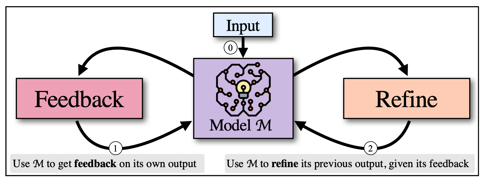
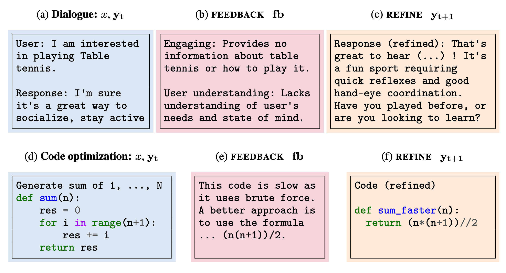
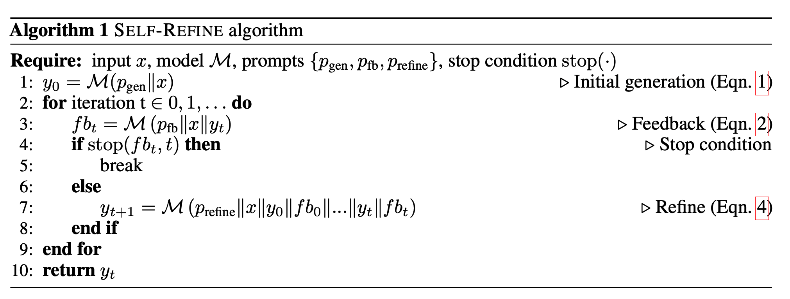
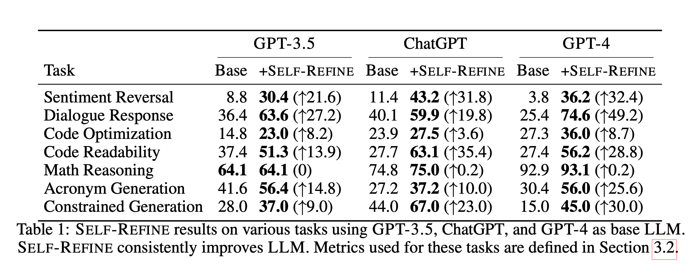
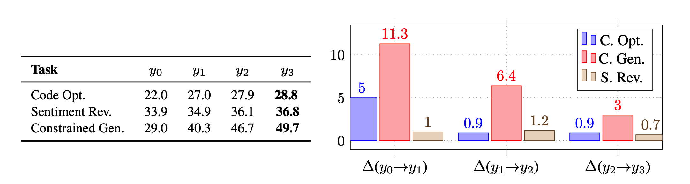
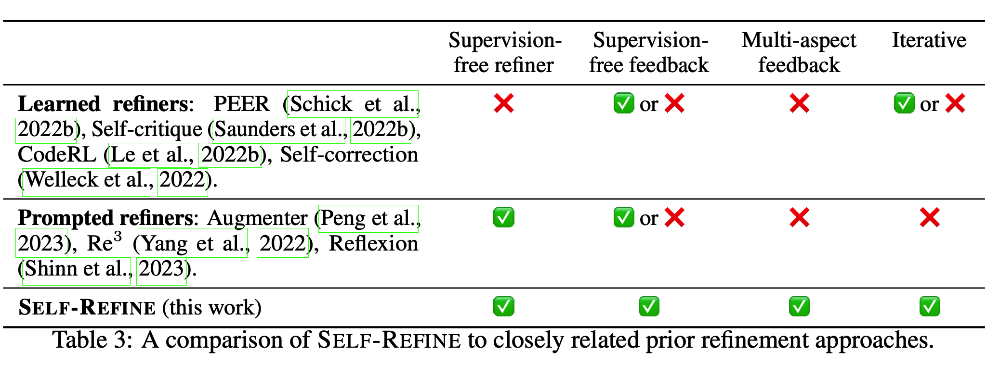

# Конспект статьи: [SELF-REFINE: Iterative Refinement with Self-Feedback](https://arxiv.org/abs/2303.17651)

## Оглавление
1. [Абстракт](#абстракт)
2. [Введение](#введение)
3. [Итеративное улучшение с SELF-REFINE](#итеративное-улучшение-с-self-refine)
4. [Оценка](#оценка)
5. [Анализ](#анализ)
6. [Связанные работы](#связанные-работы)
7. [Ограничения и обсуждение](#ограничения-и-обсуждение)

---

## Абстракт

LLM не всегда генерируют оптимальный текст с первой попытки. Для улучшения предложен метод **SELF-REFINE**, основанный на итеративном самокорректировании. В этом подходе одна и та же LLM выступает в роли генератора, оценщика и доработчика. Ключевые преимущества:

- **Отсутствие необходимости в дополнительных данных и обучении.**
- **Использование только одной модели** без применения методов обучения с подкреплением.
- **20%-ное улучшение производительности** на задачах математического и программного кода.

---

## Введение

LLM могут сталкиваться с трудностями при решении задач с неявно выраженными целями, такими как улучшение читаемости кода или создание диалоговых ответов. Итеративное улучшение — распространённый способ решения таких задач, однако традиционные методы требуют значительных ресурсов для сбора данных и аннотаций.

SELF-REFINE предоставляет альтернативу: одна и та же модель создаёт начальный вывод, генерирует обратную связь и дорабатывает результат. Это позволяет:

1. **Сократить зависимость от обучения на данных.**
2. **Универсально применять метод для разных задач.**
3. **Минимизировать затраты на аннотации.**

Пример: пользователь может написать простой запрос (например, улучшить текст или код), а модель самостоятельно улучшит результат.

---

## Итеративное улучшение с SELF-REFINE

SELF-REFINE состоит из двух ключевых шагов: предоставление обратной связи и доработка. Эти шаги повторяются до достижения заданного условия остановки.

### Шаги метода

1. **Начальная генерация**: модель $M$ создаёт начальный вывод $y_0$:
   
   $y_0 = M(p_{\text{gen}} \| x)$

   где $p_{\text{gen}}$ — промпт генерации, $x$ — входные данные.

2. **Обратная связь**: модель анализирует свой вывод $y_t$ и предоставляет обратную связь $fb_t$:
   
   $fb_t = M(p_{\text{fb}} \| x \| y_t)$

   Обратная связь должна быть конкретной и действенной.

3. **Доработка**: модель улучшает вывод на основе обратной связи:
   
   $y_{t+1} = M(p_{\text{refine}} \| x \| y_0 \| fb_0 \ \dots \| y_t \| fb_t)$

4. **Итерация**: шаги повторяются, пока не будет достигнуто условие остановки (например, заданное число итераций или качественный критерий).

### Пример алгоритма SELF-REFINE

---

## Оценка

SELF-REFINE был протестирован на 7 задачах, включая:

- **Диалоги**: создание более качественных ответов.
- **Оптимизация кода**: улучшение эффективности алгоритмов.
- **Математическое рассуждение**: решение сложных задач с шагами рассуждения.
- **Улучшение читаемости кода**: добавление комментариев и изменение переменных.

### Основные результаты

1. **Улучшение производительности:**

2. **Метрики:**
   - **Автоматические метрики** (для математики % решённых задач, для кода % оптимизированного кода итд)
   - **Human-pref:** предпочтения людей через A/B-тесты.
   - **GPT-4-pref:** автоматическая оценка с использованием GPT-4, как было с **Human-pref**.

---

## Анализ

1. **Качество обратной связи:**
   - Конкретная и действенная обратная связь улучшает результаты.
   - Генерация общей обратной связи менее эффективна.

2. **Роль итераций:**
   - Наибольшее улучшение происходит в первых итерациях.
   - С каждой итерацией прирост качества уменьшается.

3. **Сравнение с альтернативами:**
   - Генерация нескольких выходов одновременно (без итераций) менее эффективна.

---

## Связанные работы

SELF-REFINE сравнивается с:

1. **PEER и Self-Correction:**
   - Требуют обучения отдельных моделей для каждой задачи.
   - SELF-REFINE использует одну модель для всех шагов.

2. **Обучение с подкреплением (RL):**
   - Требуют оптимизации функции вознаграждения и изменения параметров модели.
   - SELF-REFINE обходится без обучения.

---

## Ограничения и обсуждение

1. **Требования к моделям:** метод требует моделей с хорошими few-shot и instruction-following способностями.
2. **Языковые ограничения:** эксперименты проводились только на английском языке.

---

